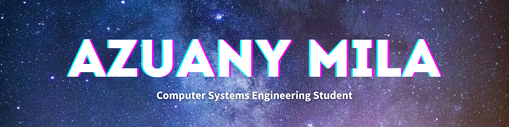

# Azuany Mila

> "Building software for people, not the other way around."

I am a Computer Systems Engineering student in the UDLAP and an alumna of the Apple Developer Academy. My engineering focus lives at the exact intersection of native iOS development, human-computer interaction, and machine learning. 

Whether I am integrating Core ML models for live sports analytics or engineering hardware for visually impaired students, I care deeply about the practical, accessible impact of technology.

---

### Current Trajectory
- **Engineering at Apple:** Returning as a Software Engineering Intern on the **Accessibility** team in Cupertino (Summer 2026), following my previous internship on the **Xcode Previews** team (Summer 2025).
- **Academic Research:** Developing an on-device iOS and macOS application utilizing computer vision to automatically detect document layouts and convert presentations into accessible PDFs. 
- **STEM Advocacy:** Teaching computational thinking and interface modification to primary school students using Swift Playgrounds.

---

### Featured Architecture & Projects

Find my complete portfolio at [azuanymila.me](https://azuanymila.me/).

| Project | Description | Core Technology |
| :--- | :--- | :--- |
| **ColorScore** | Real-time native iOS application that uses on-device machine learning to detect and overlay customizable geometric shapes on soccer players during live matches. | `SwiftUI`, `Core ML`, `K-Means` |
| **FemCoding Challenge 2026** | My very first hackathon experience! I designed a native platform connecting STEM students with mentors using a custom matching algorithm. | `Swift`, `UIKit`, `XCTest` |
| **Stomadida** | A multi-platform application providing interactive 3D healthcare tutorials for ostomy care, developed in collaboration with international healthcare professionals. | `visionOS`, `iPadOS`, `ARKit` |
| **Accessible Tactile Abacus** | Hardware-software system designed for visually impaired students, translating physical movements into speakable audio feedback. | `Verilog`, `C`, `ESP32` |

---

### Publications

- **MICAI 2024:** Co-author of *"Easy for Us, Complex for AI: Assessing the Coherence of Generated Realistic Images,"* exploring the tangible evaluation of generative models.

---

### Technical Arsenal

**Core Competencies:** Native Apple Ecosystem, Human-Computer Interaction, Machine Learning Pipelines, Automated Testing.

| Category | Technologies |
| :--- | :--- |
| **Languages** | `Swift` `Python` `C` `Java` |
| **Apple Development** | `SwiftUI` `UIKit` `visionOS` `ARKit` `AVFoundation` |
| **AI & Data Science** | `Core ML` `PyTorch` `TensorFlow` `OpenCV` `YOLO` `LLMs` |
| **Engineering Tools** | `XCTest` `Git` `Neovim` `LaTeX` `Docker` `Supabase` |

---

### Beyond the Terminal

When I am not writing code or evaluating models, you can find me assembling complex jigsaw puzzles, playing video games, or reading some drama. 
